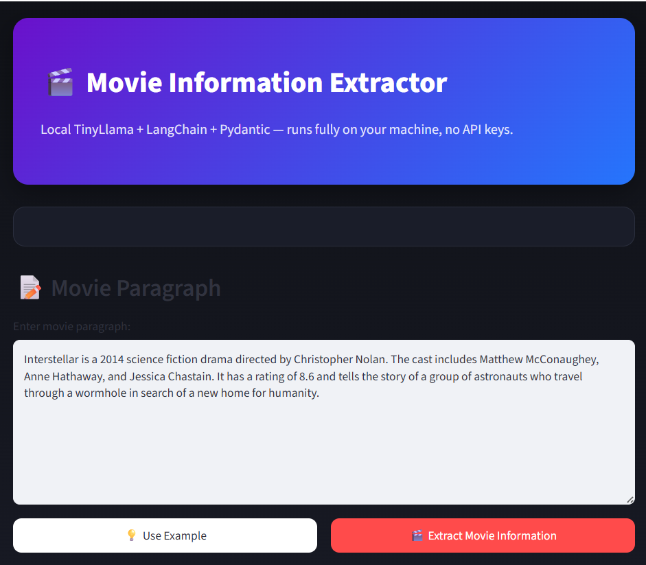
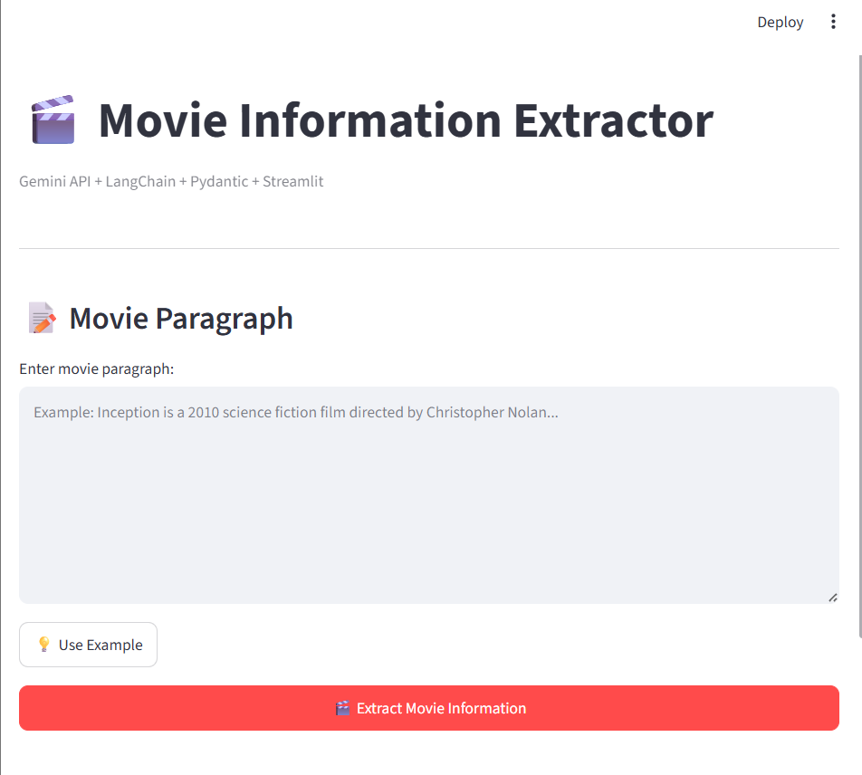
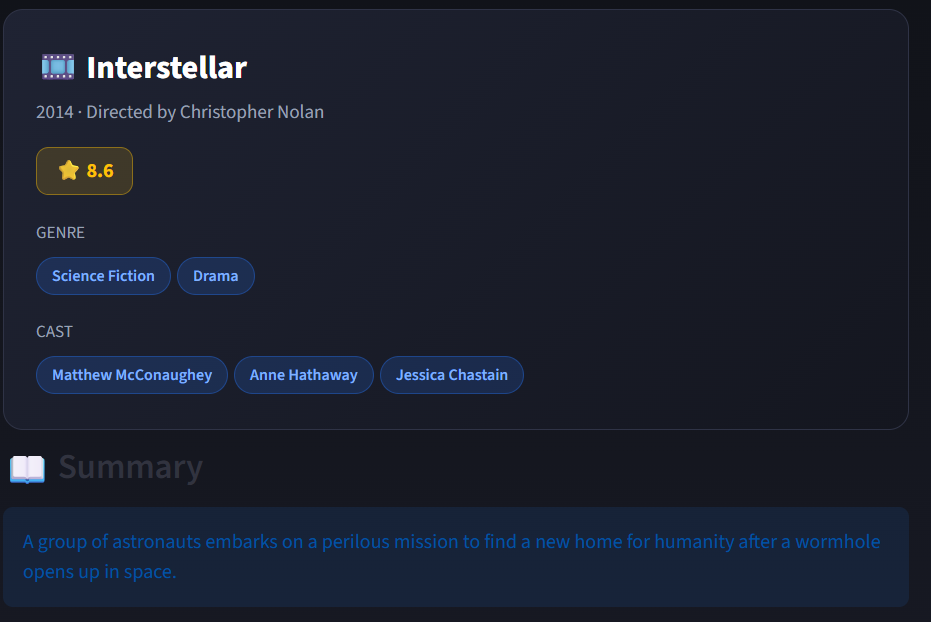
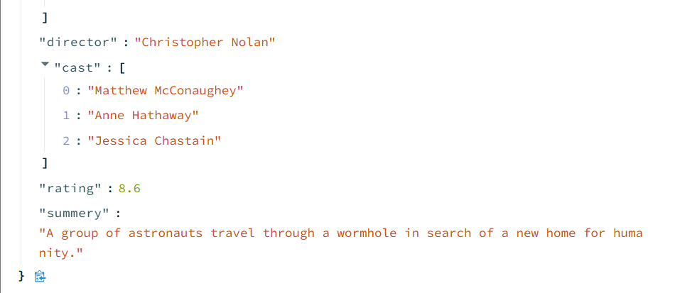
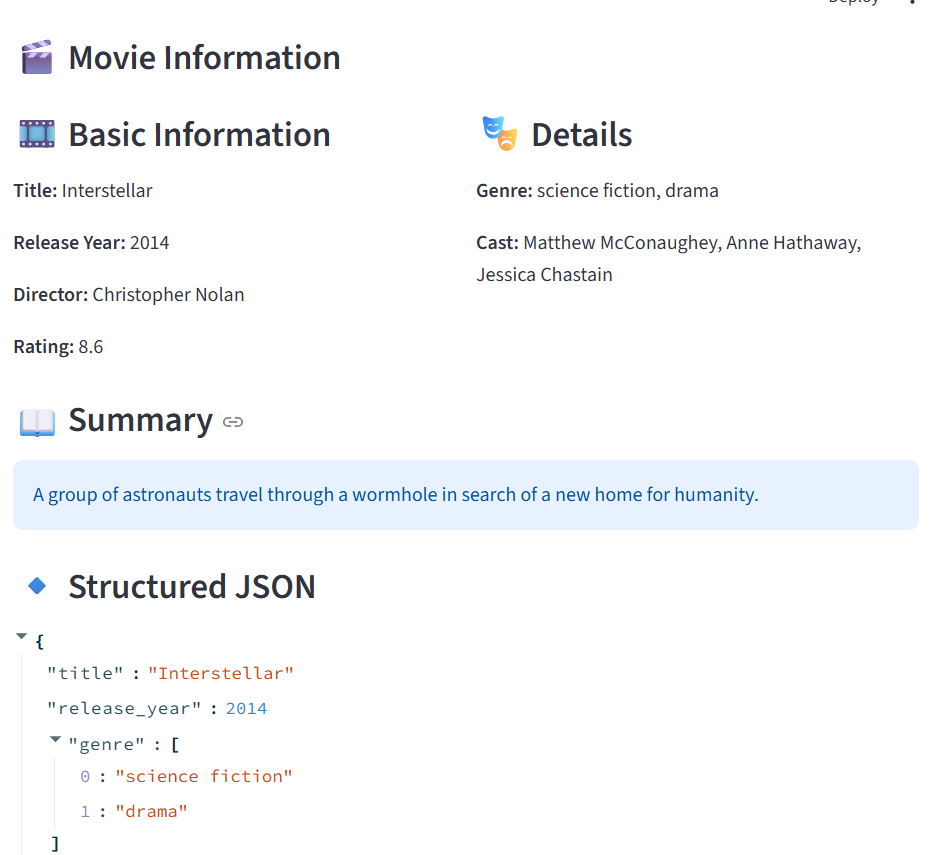

# 🎬 Movie Information Extractor

<p align="center">

  

</p>

<p align="center">


</p>

<p align="center">

<b>Extract structured movie information from natural language using Generative AI.</b>

</p>

---

## 📌 Table of Contents

* [Overview](#-overview)
* [Live Applications](#-live-applications)
* [Application Screenshots](#-application-screenshots)
* [Features](#-features)
* [Quick Start](#-quick-start)
* [Problem Statement](#-problem-statement)
* [Project Goal](#-project-goal)
* [Architecture](#️-architecture)
* [Technologies](#-technologies)
* [Requirements](#-requirements)
* [Project Development Phases](#-project-development-phases)
* [Project Structure](#-project-structure)
* [Movie Data Schema](#-movie-data-schema)
* [Environment Variables](#-environment-variables)
* [Local AI Version](#-local-ai-version)
* [Supported Models](#-supported-models)
* [Gemini API Version](#️-gemini-api-version)
* [FastAPI Backend](#-fastapi-backend)
* [Render Deployment](#-render-deployment)
* [Running the Application](#️-running-the-application)
* [Example Input](#-example-input)
* [Example Output](#-example-output)
* [Structured Output](#-structured-output)
* [Pydantic Validation](#️-pydantic-validation)
* [Error Handling](#️-error-handling)
* [Testing](#-testing)
* [Security](#-security)
* [Limitations](#️-limitations)
* [Future Improvements](#-future-improvements)
* [Learning Outcomes](#-learning-outcomes)
* [Complete Project Lifecycle](#-complete-project-lifecycle)
* [Why This Project Matters](#-why-this-project-matters)
* [License](#-license)
* [Author](#-author)
* [Project Status](#-project-status)

---

## 🌟 Overview

**Movie Information Extractor** is an AI-powered application that transforms **unstructured movie descriptions** into **structured, validated JSON** using Large Language Models.

The project supports two primary AI engines:

* 🤖 **Local AI** — TinyLlama running locally
* ☁️ **Cloud AI** — Google Gemini through LangChain

The project also provides a **FastAPI backend** that exposes the movie extraction functionality through a REST API.

The application is built with:

* Python
* LangChain
* Google Gemini
* TinyLlama
* Hugging Face Transformers
* Pydantic
* Streamlit
* FastAPI
* Pytest
* UV
* Git and GitHub
* Render

For example, given:

> Inception is a 2010 science-fiction thriller film directed by Christopher Nolan. The movie stars Leonardo DiCaprio and Tom Hardy.

The system can extract:

```json
{
  "title": "Inception",
  "release_year": 2010,
  "genre": [
    "science fiction",
    "thriller"
  ],
  "director": "Christopher Nolan",
  "cast": [
    "Leonardo DiCaprio",
    "Tom Hardy"
  ],
  "rating": null,
  "summery": "Inception is a 2010 science-fiction thriller film directed by Christopher Nolan."
}
```

This demonstrates the important Generative AI pattern:

```text
Unstructured Text
       ↓
       LLM
       ↓
Structured JSON
       ↓
Pydantic Validation
       ↓
Application
```

---

# 🌐 Live Applications

The project is deployed using **Streamlit Cloud** and **Render**.

### 🎨 Streamlit Application

The Streamlit application provides the interactive user interface.

**Live App:**

https://robelgher16-ai-genera-movie-information-extractorapp-api-0b0ucj.streamlit.app/

The Streamlit application uses Google Gemini and provides:

* Movie description input
* AI extraction
* Structured movie information
* JSON output
* Download functionality
* User-friendly interface

---

### ⚡ FastAPI Backend

The FastAPI backend is deployed on Render.

**API Base URL:**

https://movie-information-extractor-api.onrender.com

**Swagger Documentation:**

https://movie-information-extractor-api.onrender.com/docs

**OpenAPI Schema:**

https://movie-information-extractor-api.onrender.com/openapi.json

**Health Check:**

https://movie-information-extractor-api.onrender.com/health

**Movie Extraction Endpoint:**

```text
POST /extract
```

The deployed API has been successfully tested.

### API Health Check

```json
{
  "status": "ok"
}
```

### API Extraction Test

The `/extract` endpoint successfully returned structured movie information with HTTP status:

```text
200 OK
```

---

## 📸 Application Screenshots

### 🏠 1. Local Version — Home Page


The default interface of the TinyLlama version where users can paste a movie description and extract structured information locally.

---

### ☁️ 2. Gemini API Version



The cloud-powered version uses Google Gemini through LangChain for structured movie extraction.

---

### 🎬 3. Extracted Movie Information



After processing, the application displays:

* Movie title
* Release year
* Director
* Genres
* Cast
* Rating
* Summary

---

### 📄 4. Structured JSON Output



The validated Pydantic output is displayed as formatted JSON and can be downloaded.

---

### ☁️ 5. Gemini API — Extracted Result



The Gemini API version displays the extracted movie information using the same Streamlit interface.

---

# ✨ Features

## 🤖 AI Features

* Natural language movie understanding
* Structured information extraction
* Prompt engineering with LangChain
* Pydantic schema validation
* Local TinyLlama inference
* Google Gemini API integration
* Missing-value handling
* JSON normalization

## 🖥️ UI Features

* Modern Streamlit interface
* Movie information cards
* Genre badges
* Cast badges
* JSON viewer
* Raw model output viewer
* Download JSON button
* Example input generator
* Error messages

## ⚡ API Features

* FastAPI REST backend
* `/health` health-check endpoint
* `/extract` movie extraction endpoint
* Automatic OpenAPI documentation
* Swagger UI
* Pydantic request validation
* Pydantic response validation
* Render cloud deployment

## 🔐 Privacy & Security

* TinyLlama can run completely locally
* Local mode does not require an API key
* Gemini credentials are stored outside the source code
* `.env` is excluded from Git
* Render API credentials are stored in Render Environment Variables

---

# 🚀 Quick Start

## 1. Clone the Repository

```bash
git clone https://github.com/robelgher16-ai/GENERATIVE_AI_PROJECTS.git

cd GENERATIVE_AI_PROJECTS
```

Navigate to the project:

```bash
cd Movie_Information_Extractor
```

---

## 2. Create a Virtual Environment with UV

```powershell
uv venv
```

Activate it:

```powershell
.venv\Scripts\activate
```

---

## 3. Install Dependencies

Using UV:

```powershell
uv sync
```

Or:

```powershell
uv pip install -r requirements.txt
```

---

## 4. Run the Local TinyLlama Version

```powershell
streamlit run app_local.py
```

---

## 5. Run the Gemini Streamlit Version

Create a `.env` file:

```env
GOOGLE_API_KEY=your_google_api_key_here
```

Then run:

```powershell
streamlit run app_api.py
```

---

# ❓ Problem Statement

Movie information is often stored in unstructured formats such as:

* Articles
* Reviews
* News
* Wikipedia-style descriptions
* Documents
* Web pages
* Natural-language text

Extracting information manually from these sources can be slow and inconsistent.

This project uses an LLM to automatically identify and organize important movie information into a predictable structure.

---

# 🎯 Project Goal

The main goal is to build a reliable AI application capable of:

1. Accepting unstructured movie text.
2. Understanding movie information.
3. Extracting relevant fields.
4. Producing structured JSON.
5. Validating extracted information with Pydantic.
6. Displaying results through Streamlit.
7. Exposing extraction through a FastAPI REST API.
8. Supporting both local and cloud-based LLMs.
9. Deploying the application to the cloud.

---

# 🏗️ Architecture

```text
                  MOVIE INFORMATION EXTRACTOR
                              │
                ┌─────────────┴─────────────┐
                │                           │
          LOCAL VERSION                CLOUD VERSION
                │                           │
           TinyLlama                     Gemini
                │                           │
                └─────────────┬─────────────┘
                              │
                         LangChain
                              │
                    ChatPromptTemplate
                              │
                     Movie Description
                              │
                        LLM Processing
                              │
                      Structured JSON
                              │
                    Pydantic Validation
                              │
                    Validated Movie Data
                              │
             ┌────────────────┴────────────────┐
             │                                 │
        Streamlit UI                      FastAPI API
             │                                 │
       Local / Cloud UI                    REST API
                                               │
                                           Render Cloud
```

---

# 🧠 Technologies

| Technology     | Purpose                                |
| -------------- | -------------------------------------- |
| Python         | Programming language                   |
| UV             | Python package/environment management  |
| LangChain      | LLM application framework              |
| LangChain Core | Prompt templates and core abstractions |
| Google Gemini  | Cloud LLM                              |
| TinyLlama      | Local LLM                              |
| Hugging Face   | Local model integration                |
| Transformers   | Local model execution                  |
| PyTorch        | Deep learning framework                |
| Pydantic       | Data validation                        |
| FastAPI        | REST API backend                       |
| Uvicorn        | ASGI server                            |
| python-dotenv  | Environment variable management        |
| Streamlit      | Web application UI                     |
| Pytest         | Automated testing                      |
| Git            | Version control                        |
| GitHub         | Code hosting                           |
| Render         | API deployment                         |

---

# 📦 Requirements

* Python 3.13+
* UV package manager
* 8 GB RAM recommended for TinyLlama
* Internet connection for Gemini
* Google Gemini API key for cloud mode

For the FastAPI backend:

```text
FastAPI
Uvicorn
LangChain Core
LangChain Google GenAI
Pydantic
python-dotenv
```

---

# 🚀 Project Development Phases

## Phase 1 — UV + LangChain Setup

The project environment was created using UV.

Main concepts:

* UV installation
* Virtual environments
* Package management
* LangChain installation
* Project initialization

---

## Phase 2 — Environment & Security

Environment variables were introduced for API credentials.

Implemented:

* `.env`
* `.env.example`
* `.gitignore`
* Environment variable loading
* Secret protection

---

## Phase 3 — Chat Models

Two LLM approaches were implemented.

### API Model

Google Gemini through LangChain.

### Local Model

TinyLlama through Hugging Face.

This demonstrated the difference between:

```text
Cloud LLM
   ↓
API Request
   ↓
Model Response
```

and:

```text
Local LLM
   ↓
Local Model
   ↓
Local Inference
```

---

## Phase 4 — Prompt Engineering

A movie extraction prompt was created.

The prompt instructs the model to:

* Extract movie information
* Avoid guessing
* Return null for unknown values
* Follow a specific schema
* Produce structured information

---

## Phase 5 — Structured Output

Pydantic was introduced to define the movie schema.

The system validates the model output before displaying it.

The local version performs additional JSON extraction and validation because smaller local models can produce additional text around JSON.

---

## Phase 6 — Streamlit UI

A complete Streamlit interface was developed.

The UI includes:

* Application header
* Sidebar
* Movie input
* Example button
* Extraction button
* Movie result card
* Genre badges
* Cast badges
* Rating
* Summary
* JSON output
* Raw model output
* Download button
* Error messages

---

## Phase 7 — Testing & Error Handling

Testing was introduced for:

* Pydantic movie validation
* JSON extraction
* Valid JSON
* Markdown-wrapped JSON
* Invalid model responses

The application also handles:

* Invalid JSON
* Missing fields
* Empty values
* Unexpected model output
* Validation errors

---

## Phase 8 — Documentation

Professional documentation was created.

This includes:

* README
* Installation instructions
* Architecture
* Project structure
* Usage instructions
* Security information
* Deployment information
* Future improvements
* Testing information

---

## Phase 9 — Git & GitHub

The project was prepared for version control using Git.

Sensitive files such as `.env` and the virtual environment are excluded using `.gitignore`.

The project is hosted in:

```text
GENERATIVE_AI_PROJECTS
```

GitHub repository:

https://github.com/robelgher16-ai/GENERATIVE_AI_PROJECTS

---

## Phase 10 — FastAPI Backend

A FastAPI backend was added to expose the movie extraction functionality through a REST API.

The backend provides:

```text
GET  /health
POST /extract
```

The API uses:

```text
FastAPI
   ↓
LangChain
   ↓
Gemini
   ↓
Pydantic
   ↓
Structured Movie Response
```

---

## Phase 11 — Cloud Deployment

The FastAPI backend was deployed to Render.

Deployment configuration:

```text
Platform: Render
Service: movie-information-extractor-api
Environment: Python 3
Branch: main
Root Directory: Movie_Information_Extractor
Build Command: pip install -r requirements-api.txt
Start Command: uvicorn api:app --host 0.0.0.0 --port $PORT
Health Check: /health
```

The deployment successfully started Uvicorn and passed the health check.

---

# 📁 Project Structure

```text
GENERATIVE_AI_PROJECTS/
│
└── Movie_Information_Extractor/
    │
    ├── api.py
    ├── app_local.py
    ├── app_api.py
    │
    ├── chatmodels/
    │   ├── __init__.py
    │   ├── api.py
    │   └── locally.py
    │
    ├── screenshots/
    │   ├── local-home.png
    │   ├── local-result.png
    │   ├── api-home.png
    │   ├── api-result.png
    │   └── raw-json.png
    │
    ├── src/
    │   └── movie_information_extractor/
    │       └── __init__.py
    │
    ├── tests/
    │   ├── __init__.py
    │   ├── test_movie_model.py
    │   └── test_json_parser.py
    │
    ├── .env.example
    ├── .gitignore
    ├── .python-version
    ├── LICENSE
    ├── README.md
    ├── requirements.txt
    ├── requirements-api.txt
    ├── pyproject.toml
    └── uv.lock
```

### Important

The following files should **never be committed**:

```text
.env
.venv/
*.pth
*.pt
*.bin
*.safetensors
```

---

# 🧾 Movie Data Schema

The extracted movie information follows this schema:

```python
class Movie(BaseModel):
    title: str
    release_year: Optional[int]
    genre: List[str]
    director: Optional[str]
    cast: List[str]
    rating: Optional[float]
    summery: str
```

## Fields

| Field          | Type            | Description         |
| -------------- | --------------- | ------------------- |
| `title`        | `str`           | Movie title         |
| `release_year` | `int \| None`   | Movie release year  |
| `genre`        | `List[str]`     | Movie genres        |
| `director`     | `str \| None`   | Movie director      |
| `cast`         | `List[str]`     | Main cast members   |
| `rating`       | `float \| None` | Movie rating        |
| `summery`      | `str`           | Short movie summary |

> **Note:** The field name `summery` is preserved for compatibility with Version 1.0. It can be renamed to `summary` in a future breaking release.

---

# 🔐 Environment Variables

For the Gemini version, create a `.env` file:

```env
GOOGLE_API_KEY=your_google_api_key_here
```

The local TinyLlama version does not require an API key.

### Production Deployment

For the Render FastAPI deployment, the Google API key is stored securely as a **Render Environment Variable**.

It is not stored in the GitHub repository.

### Important Security Rule

Never commit `.env` to GitHub.

Your `.gitignore` should contain:

```gitignore
.env
```

If an API key is accidentally pushed to GitHub, revoke or rotate it immediately.

---

# 🤖 Local AI Version

The local version uses:

```text
TinyLlama/TinyLlama-1.1B-Chat-v1.0
```

The model runs locally through:

```text
Hugging Face
      ↓
Transformers
      ↓
LangChain HuggingFace
      ↓
TinyLlama
      ↓
Movie Extraction
```

### Advantages

* No API key
* Local inference
* Better privacy
* Can work without sending movie text to a cloud API
* Useful for learning local LLM deployment

### Limitations

TinyLlama is a relatively small model.

It may sometimes produce:

* Additional explanation
* Incorrect JSON
* Multiple JSON objects
* Schema text
* Unexpected formatting

Therefore, the local application includes additional JSON extraction and validation logic.

---

# 🤖 Supported Models

| Mode  | Model                    |
| ----- | ------------------------ |
| Local | TinyLlama-1.1B-Chat-v1.0 |
| Cloud | Gemini                   |

The local version provides local inference, while the cloud version uses Google's Gemini API.

The exact Gemini model is configured in the application code and may change as supported models evolve.

---

# ☁️ Gemini API Version

The Gemini version uses Google Gemini through LangChain.

The general workflow is:

```text
Movie Text
     ↓
ChatPromptTemplate
     ↓
Gemini
     ↓
Structured Response
     ↓
Pydantic Validation
     ↓
Streamlit / FastAPI
```

The Gemini version provides stronger instruction following than the small local TinyLlama model.

---

# ⚡ FastAPI Backend

The project includes a dedicated FastAPI backend in:

```text
api.py
```

The backend exposes two endpoints.

## Health Check

```http
GET /health
```

Response:

```json
{
  "status": "ok"
}
```

---

## Extract Movie Information

```http
POST /extract
```

Request:

```json
{
  "paragraph": "Inception is a 2010 science fiction thriller film directed by Christopher Nolan. The movie stars Leonardo DiCaprio, Joseph Gordon-Levitt, Ellen Page, and Tom Hardy. It has a rating of 8.8."
}
```

Response:

```json
{
  "title": "Inception",
  "release_year": 2010,
  "genre": [
    "science fiction",
    "thriller"
  ],
  "director": "Christopher Nolan",
  "cast": [
    "Leonardo DiCaprio",
    "Joseph Gordon-Levitt",
    "Ellen Page",
    "Tom Hardy"
  ],
  "rating": 8.8,
  "summery": "Inception is a 2010 science fiction thriller film directed by Christopher Nolan, starring Leonardo DiCaprio, Joseph Gordon-Levitt, Ellen Page, and Tom Hardy."
}
```

---

# 🌐 Render Deployment

The FastAPI backend is deployed using Render.

### Production URL

https://movie-information-extractor-api.onrender.com

### Swagger UI

https://movie-information-extractor-api.onrender.com/docs

### OpenAPI

https://movie-information-extractor-api.onrender.com/openapi.json

### Health Check

https://movie-information-extractor-api.onrender.com/health

### Extraction Endpoint

```text
POST https://movie-information-extractor-api.onrender.com/extract
```

### Deployment Status

```text
Build: Successful
Deployment: Live
Health Check: 200 OK
Extraction Endpoint: 200 OK
```

The Render free instance may spin down after inactivity. The first request after inactivity can therefore take longer while the service starts again.

---

# ▶️ Running the Application

## Local Version

Activate the environment:

```powershell
.venv\Scripts\activate
```

Run:

```powershell
streamlit run app_local.py
```

---

## Gemini Streamlit Version

Make sure `.env` contains your Google API key.

Then:

```powershell
streamlit run app_api.py
```

---

## FastAPI Local Version

Install the API dependencies:

```powershell
pip install -r requirements-api.txt
```

Run the server:

```powershell
uvicorn api:app --reload
```

Open Swagger:

```text
http://127.0.0.1:8000/docs
```

---

# 📝 Example Input

```text
Inception is a 2010 science-fiction thriller film directed by Christopher Nolan. The movie stars Leonardo DiCaprio, Joseph Gordon-Levitt, Ellen Page, Tom Hardy, and Ken Watanabe. The story follows Dom Cobb, a skilled thief who enters people's dreams to steal information. The film was produced by Warner Bros.
```

---

# 📤 Example Output

```json
{
  "title": "Inception",
  "release_year": 2010,
  "genre": [
    "science fiction",
    "thriller"
  ],
  "director": "Christopher Nolan",
  "cast": [
    "Leonardo DiCaprio",
    "Joseph Gordon-Levitt",
    "Ellen Page",
    "Tom Hardy",
    "Ken Watanabe"
  ],
  "rating": null,
  "summery": "A skilled thief enters people's dreams to steal information."
}
```

---

# 🧩 Structured Output

One of the main goals of this project is converting:

```text
Unstructured Natural Language
```

into:

```text
Structured Data
```

For example:

```text
"Inception is a 2010 science-fiction film..."
```

becomes:

```json
{
  "title": "Inception",
  "release_year": 2010,
  "genre": [
    "Science Fiction"
  ]
}
```

This type of transformation is useful for:

* Data pipelines
* Information extraction
* Document processing
* Search systems
* RAG applications
* Knowledge bases
* AI agents
* Database population
* Automation

---

# 🛡️ Pydantic Validation

Pydantic ensures that the extracted information follows the expected structure.

The pipeline is:

```text
LLM Output
    ↓
JSON Extraction
    ↓
Data Normalization
    ↓
Pydantic Validation
    ↓
Validated Movie Data
```

If the model produces an invalid structure, the application can catch the validation error instead of blindly trusting the LLM output.

---

# ⚠️ Error Handling

The application handles several possible failures.

## Invalid JSON

```text
LLM
 ↓
Invalid Output
 ↓
JSON Extraction Fails
 ↓
User-Friendly Error
```

## Missing Information

Unknown information can be represented using:

```json
null
```

or:

```json
[]
```

depending on the field.

## API Validation Error

FastAPI automatically validates incoming request data using Pydantic.

Invalid requests can return:

```text
422 Unprocessable Entity
```

---

# 🧪 Testing

The project includes automated tests using Pytest.

Run:

```powershell
pytest
```

The tests cover areas such as:

* Movie model validation
* JSON extraction
* Valid JSON
* Markdown-wrapped JSON
* Invalid responses

Example:

```python
def test_movie_model():
    movie = Movie(
        title="Inception",
        release_year=2010,
        genre=["Science Fiction", "Action"],
        director="Christopher Nolan",
        cast=["Leonardo DiCaprio"],
        rating=8.8,
        summery="A thief enters people's dreams."
    )

    assert movie.title == "Inception"
    assert movie.release_year == 2010
    assert movie.director == "Christopher Nolan"
```

---

# 🔒 Security

This project uses environment variables for API credentials.

### Never commit:

```text
.env
```

### Never hard-code:

```python
GOOGLE_API_KEY = "your-real-key"
```

Instead:

```python
from dotenv import load_dotenv

load_dotenv()
```

and store credentials inside `.env`.

For production deployment, credentials are stored in the hosting platform's secure environment-variable system.

A safe example file is provided as:

```text
.env.example
```

with:

```env
GOOGLE_API_KEY=your_google_api_key_here
```

---

# ⚠️ Limitations

## Local Model

TinyLlama is a small language model and may not always follow strict JSON instructions.

Possible issues include:

* Hallucinated information
* Incorrect formatting
* Incomplete extraction
* Additional text
* Incorrect field values

Therefore, model output should not automatically be treated as guaranteed factual information.

---

## Gemini API

The Gemini version depends on:

* Internet connectivity
* API availability
* API limits
* API credentials
* Supported model availability

---

## Movie Information

The application extracts information from the text provided by the user.

It does not independently verify movie information against an external movie database.

Therefore:

```text
Extraction ≠ Fact Verification
```

---

# 🚀 Future Improvements

## Version 2

* Better JSON repair
* Improved validation
* More robust model fallback
* Better logging
* More unit tests
* API authentication
* API rate limiting

## Version 3

Add external movie databases:

```text
Movie Text
    ↓
LLM Extraction
    ↓
Movie Database
    ↓
Fact Verification
    ↓
Validated Movie
```

## Version 4

Add RAG:

```text
Movie Documents
       ↓
Document Loader
       ↓
Chunking
       ↓
Embeddings
       ↓
Vector Database
       ↓
Retriever
       ↓
LLM
       ↓
Movie Information
```

## Version 5

Add an AI Agent capable of:

* Searching movie information
* Comparing movies
* Finding actors
* Finding directors
* Summarizing reviews
* Answering movie questions

## Version 6

Improve production infrastructure:

* Docker
* CI/CD
* GitHub Actions
* Monitoring
* Logging
* Automated testing
* Production API authentication
* Scalable cloud infrastructure

---

# 📚 Learning Outcomes

This project demonstrates practical knowledge of:

## Python

* Classes
* Functions
* Type hints
* Error handling
* Environment variables

## LangChain

* Chat models
* Prompt templates
* Output parsing
* Hugging Face integration

## Generative AI

* LLM prompting
* Structured generation
* Local LLMs
* API-based LLMs
* Model limitations

## Pydantic

* Data schemas
* Validation
* Structured data
* Type safety

## Streamlit

* Interactive UI
* Session state
* Cached resources
* Custom CSS
* Downloadable results

## FastAPI

* REST APIs
* Request validation
* Response models
* OpenAPI
* Swagger documentation
* Health checks

## Software Engineering

* Virtual environments
* Dependency management
* Testing
* Git
* GitHub
* Secret management
* Cloud deployment
* API development
* Project documentation

---

# 🔄 Complete Project Lifecycle

```text
PHASE 1
UV + LangChain
      ↓
PHASE 2
Environment + Security
      ↓
PHASE 3
Chat Models
      ↓
PHASE 4
Prompt Engineering
      ↓
PHASE 5
Structured Output
      ↓
PHASE 6
Streamlit UI
      ↓
PHASE 7
Testing + Error Handling
      ↓
PHASE 8
Documentation
      ↓
PHASE 9
Git + GitHub
      ↓
PHASE 10
FastAPI Backend
      ↓
PHASE 11
Cloud Deployment
      ↓
PROJECT COMPLETE
```

---

# 💡 Why This Project Matters

Although the application is relatively small, it demonstrates an important pattern used in modern AI engineering:

```text
Natural Language
       ↓
      LLM
       ↓
Structured Data
       ↓
Validation
       ↓
Application
       ↓
API
       ↓
Cloud Deployment
```

This pattern appears in many production AI systems, including:

* Resume parsers
* Invoice extraction
* Medical document processing
* Customer-support systems
* Legal document analysis
* RAG pipelines
* AI agents
* Enterprise automation

The project therefore serves as a foundation for more advanced **Generative AI and AI Engineering applications**.

---

# 📜 License

This project is licensed under the MIT License.

See the `LICENSE` file for details.

---

# 👨‍💻 Author

**Robel**

AI / Machine Learning Engineer in training.

Focused on:

* Artificial Intelligence
* Machine Learning
* Deep Learning
* Generative AI
* NLP
* Computer Vision
* AI Engineering

---

# ⭐ Project Status

| Feature               | Status |
| --------------------- | ------ |
| Local TinyLlama       | ✅      |
| Gemini API            | ✅      |
| Prompt Engineering    | ✅      |
| Structured Output     | ✅      |
| Pydantic Validation   | ✅      |
| Streamlit UI          | ✅      |
| FastAPI Backend       | ✅      |
| Swagger Documentation | ✅      |
| Render Deployment     | ✅      |
| Health Check          | ✅      |
| Production API Test   | ✅      |
| Automated Testing     | ✅      |
| GitHub Ready          | ✅      |
| Documentation         | ✅      |

**Current Release:** `Version 1.0`

**Deployment Status:** `Production / Live`

---

# 🎬 Final Result

The **Movie Information Extractor** demonstrates a complete beginner-to-intermediate Generative AI application lifecycle:

```text
IDEA
 ↓
ENVIRONMENT
 ↓
LLM
 ↓
PROMPT
 ↓
STRUCTURED OUTPUT
 ↓
VALIDATION
 ↓
UI
 ↓
API
 ↓
TESTING
 ↓
CLOUD DEPLOYMENT
 ↓
DOCUMENTATION
 ↓
GITHUB
```

## Project 1 — Movie Information Extractor

A complete Generative AI project with:

```text
Local AI
   +
Cloud AI
   +
Streamlit
   +
FastAPI
   +
Pydantic
   +
Testing
   +
GitHub
   +
Render Deployment
```
